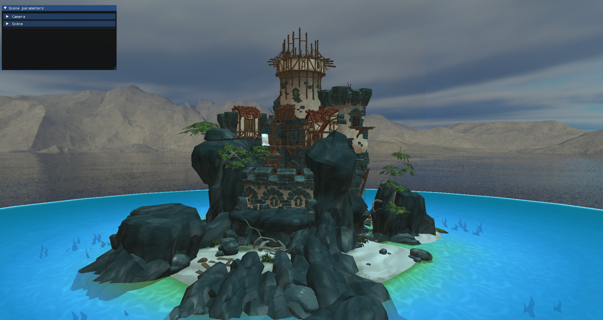
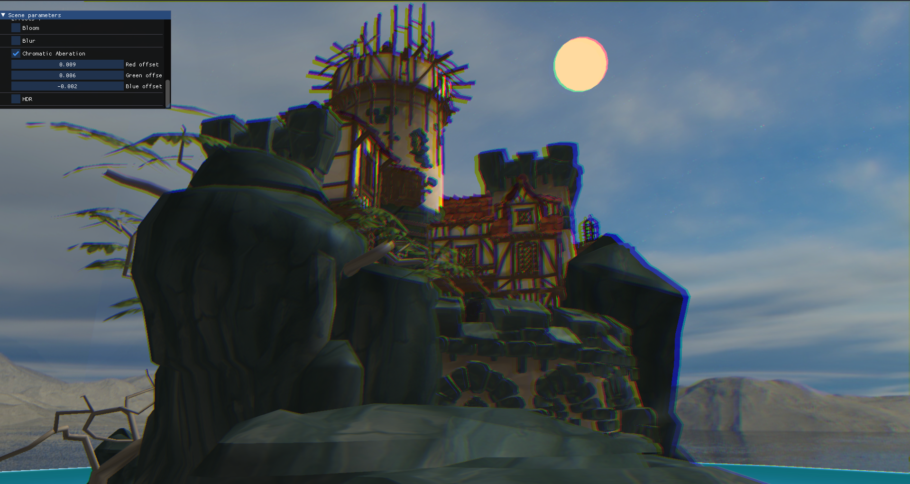

# 3DEngine

## Description
A 3D Engine made in C++ and using the Opengl API

## Installation
On linux run:
`chmod +x run.sh` to make the script executable

then `./run.sh` will create the folder containing the program,
compile and then execute it.

## Visuals

## Usage
The gui is divided into several parts:   

The first one allows you to modify the rotation speed of the camera   (mouse) and the speed of its movements (keyboard)  

The second allows you to interact with the scene, you can see the models   and lights that are loaded by the program, you can also see a section   dedicated to post-processing effects.  

Some sections also allow us to modify parameters, for example:   

By selecting a model, we can change some of its options:
Whether to draw it or not, its position or scale

The options in other sections like the light section are similar

## Authors and acknowledgment
Victor Mougel and Néo Almeida