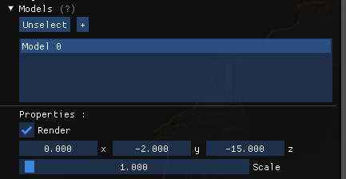

# 3DEngine

## Description
This is a 3D engine made by ALMEIDA Néo and MOUGEL Victor using C++ and the OpenGL API.

## Installation

### Engine

On linux in root folder:  

`chmod +x run.sh` to make the script executable

then `./run.sh`

> **Note**
> **building assimp can take a long time**

### Test

On linux:

`cd test` to go in the test folder    
run the command `chmod +x run.sh`  
then run the tests with `./run_test.sh`

> **Note** 
> **If you have not already built Assimp, this process may take a significant amount of time.**

## Visuals

## Usage
The gui is divided into several parts:   

The first one allows you to modify the rotation speed of the camera   (mouse) and the speed of its movements (keyboard)  

The second allows you to interact with the scene, you can see the models   and lights that are loaded by the program, you can also see a section   dedicated to post-processing effects.  

Some sections also allow us to modify parameters, for example:   

By selecting a model, we can change some of its options:
Whether to draw it or not, its position or scale

The options in other sections like the light section are similar

## Authors and acknowledgment
- [ALMEIDA Néo](https://github.com/Ninhache)
- [MOUGEL Victor](https://github.com/Cxentury)
